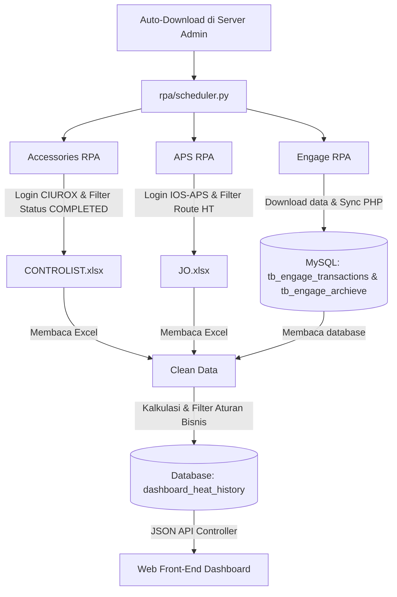
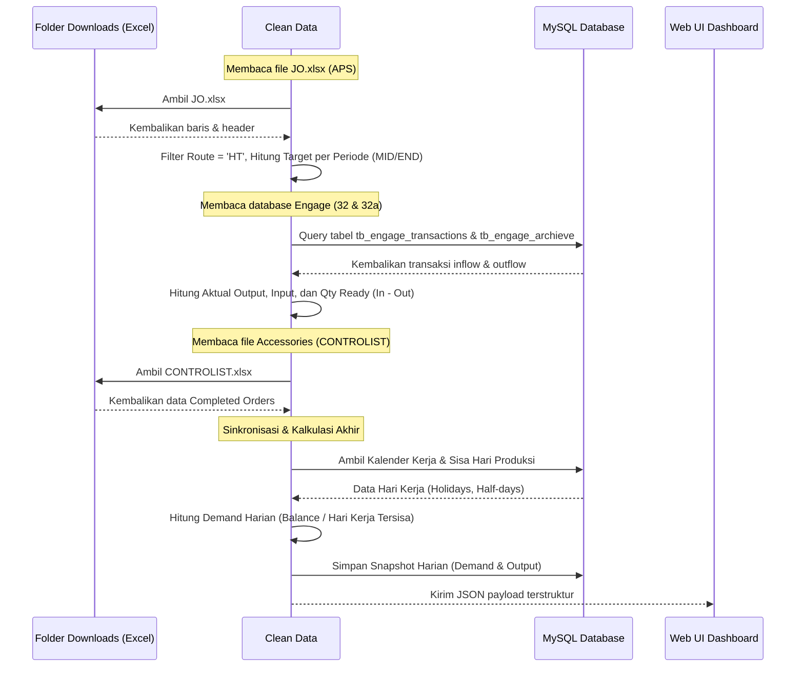

# IRL 2: Analisis Capture Data, Sumber Data, Field, Project Scope, & Process Flow
## Dashboard GM (Modul Heat Transfer)

---

## 1. Ringkasan Eksekutif

**Dashboard GM** adalah platform pemantauan produksi internal berbasis web yang dirancang khusus untuk memetakan, menganalisis, dan memvisualisasikan data operasional secara real-time. Modul utama yang berjalan saat ini adalah **Heat Transfer**, yang menggabungkan tiga dimensi data utama:
1. **Rencana & Pengiriman (Delivery/PDK)** dari sistem IOS-APS.
2. **Aktual Produksi & Aliran Barang (Inflow/Outflow)** dari sistem Engage Warehouse.
3. **Kesiapan Aksesoris Pendukung (Accessories)** dari sistem CIUROX.

Dengan memanfaatkan sistem **Robotic Process Automation (RPA)** berbasis Playwright Python dan GUI Automation Windows, dashboard ini mampu mengotomatisasi pengumpulan data dari sistem legacy yang tidak memiliki API terbuka, mengolahnya di sisi backend, dan menyajikan metrik penting seperti *Total Output*, *Balance Qty*, *Ready to Load*, *Demand Harian*, serta *Prioritas Pengiriman* kepada jajaran manajemen.

---

## 2. Analisis Proses Capture Data Existing

Proses pengumpulan data pada `dashboard_gm` dilakukan secara otomatis di sisi **Server Admin** menggunakan penjadwal master (**Master Scheduler**) dan skrip robot pemroses transaksi (**RPA Downloader**). User akhir tidak perlu memicu pengunduhan data secara manual. Alur capture data dirancang sebagai berikut:

### Mekanisme Eksekusi RPA:
1. **Master Scheduler (`rpa/scheduler.py`)**:
   - Berfungsi sebagai orchestrator utama. Dijalankan terus-menerus di server admin sebagai daemon service (aktif dari pukul 07:00 hingga 23:00 dengan interval 1 jam). Proses ini sepenuhnya otomatis (Auto-Download) di sisi server admin tanpa memerlukan interaksi atau trigger manual dari user di front-end dashboard.
   - Menggunakan sistem *file locking* Windows (`msvcrt.locking`) pada file `scheduler.lock` untuk menjamin tidak ada dua proses RPA yang berjalan secara bersamaan (mencegah bentrokan resource).
   - Menjalankan sub-modul RPA secara berurutan: **Accessories**, **Engage**, kemudian **APS** (APS dijalankan setiap 2 jam, sedangkan yang lain setiap jam).

2. **Accessories RPA (`rpa/accessories-rpa/main.py`)**:
   - **Teknologi**: Playwright Python (mode `--headless`).
   - **Metode**: Melakukan simulasi browser ke web internal CIUROX, mengisi filter tanggal (awal bulan ini s.d hari ini), menyaring status `COMPLETED`, lalu mengunduh file Excel secara asinkron.
   - **Output**: `rpa/accessories-rpa/downloads/CONTROLIST.xlsx`.

3. **Engage RPA (`rpa/engage-rpa/main.py`)**:
   - **Teknologi**: Playwright Python + sinkronisasi database PHP.
   - **Metode**: Login ke csreport Engage, membuka report warehouse, menyaring berdasarkan storage (32 dan 32a) dengan Direction 0 (gabungan/in-out), dan mengambil data transaksi untuk **10 hari terakhir**.
   - **Output dan Sinkronisasi**:
     - Menyimpan file Excel cadangan (`32_engage.xlsx` dan `32a_engage.xlsx` di folder `downloads/`) untuk pelacakan update timestamp.
     - Menyinkronkan seluruh baris data transaksi secara real-time ke database MySQL (`db_dashboardgm`) via skrip sinkronisasi transaksi (dimasukkan ke tabel `tb_engage_transactions` untuk transaksi berjalan dan `tb_engage_archieve` untuk arsip masa lampau).
     - Menyinkronkan rekapitulasi harian (input, output, ready qty) ke tabel `engage_daily_history`.

4. **APS RPA (`rpa/aps-rpa/main.py`)**:
   - **Teknologi**: Windows GUI Automation (mengontrol window desktop IOS-APS secara visual dengan keyboard dan klik koordinat mouse).
   - **Metode**: Membuka program `IOS-APS`, login dengan akun terenkripsi di `.env`, menyaring Job Order (JO) dengan rute Heat Transfer dari awal bulan lalu sampai akhir 2 bulan ke depan, dan mengekspor hasilnya.
   - **Output**: `rpa/aps-rpa/downloads/JO.xlsx`.

---

## 3. Sumber Data dan Field yang Dibutuhkan

Berikut adalah rincian data dictionary serta field yang diekstraksi dari masing-masing file hasil capture RPA untuk digunakan dalam perhitungan logika Dashboard.

### A. Data Rencana & Pengiriman (Sumber: `JO.xlsx` dari APS)
* **Deskripsi**: Menyediakan data dasar Job Order, rencana kuantitas produksi, rute proses, dan jadwal pengiriman pelanggan.
* **Filter Bisnis**: Hanya baris dengan rute Heat Transfer (`Process Route` mengandung kata "**HT**") yang diproses.

| Nama Field (Excel Header) | Tipe Data | Kegunaan dalam Dashboard |
| --- | --- | --- |
| `JO` / `Order No.` | String (Format: `1234567890-1`) | Kunci relasi utama (Order ID) untuk digabungkan dengan data aktual & aksesoris. |
| `Process Route` / `Process Route Name` | String | Validasi rute produksi (wajib mengandung sub-string "HT"). |
| `HEAT TRANSFER Plan qty` / `Heat Transfer Plan Qty` | Integer | Target rencana produksi modul Heat Transfer. |
| `HEAT TRANSFER Qty.` / `Heat Transfer Qty` | Integer | Jumlah kuantitas yang sudah selesai menurut catatan APS. |
| `HEAT TRANSFER Non-finished Qty` / `Heat Transfer Non Finished Qty` | Integer | Sisa (balance) rencana yang belum selesai dikerjakan. |
| `Plan Qty` / `Qty` | Integer | Target Qty alternatif jika kolom Heat Transfer Plan kosong. |
| `Delivery Date` | Date / Numeric Serial | Penentu periode target pengiriman (misal: "MID AUG", "END AUG"). |
| `Factory Style` / `Cust. Style` | String | Kode/nama desain pakaian (Style) untuk visualisasi UI. |

### B. Data Aktual & Aliran Barang (Sumber: Database MySQL - `tb_engage_transactions` & `tb_engage_archieve`)
* **Deskripsi**: Menyediakan log transaksi barang masuk (inflow) dan barang keluar (outflow) di area penyimpanan produksi. File Excel cadangan tetap diunduh di disk, namun pemrosesan dashboard membaca langsung dari tabel database MySQL.
* **Filter Bisnis (Storage 32)**:
  - `Udef 5` / `Udef 4` = "rpl" OR `Udef 6` = "sk" OR `Text` = ("rpl", "ts", "return", "retutn", "koreksi", "sk" tanpa "csdb"/"csbd").
* **Filter Bisnis (Storage 32a)**:
  - `Udef 5` / `Udef 4` = "rpl" OR `Udef 6` = "sk" OR `Text` = ("csdb", "csbd", "ts").
* **Logika Arah Transaksi**: Kuantitas positif dianggap **Input** (masuk ke lini produksi), kuantitas negatif dianggap **Output** (keluar/selesai).

| Nama Kolom Database | Tipe Data | Kegunaan dalam Dashboard |
| --- | --- | --- |
| `date` / `We_datum` | Date | Tanggal transaksi aktual untuk chart harian dan demand. |
| `cost_center` / `We_kstnr` / `We_prdnr` | String | Nomor Order untuk mencocokkan transaksi dengan data JO APS. |
| `qty` / `We_stck` | Integer | Jumlah barang. Positif = Input, Negatif = Output aktual. |
| `item_nr` / `We_artnr` | String | Kode barang / komponen material produksi. |
| `udef_1` / `We_flds00` | String | Informasi Style dari sisi aktual produksi. |
| `udef_3` & `udef_4` | String | Membentuk kombinasi *material key* unik agar baris tidak duplikat. |
| `text` / `We_name` | String | Catatan transaksi, digunakan dalam proses filter data. |

### C. Data Status Accessories (Sumber: `CONTROLIST.xlsx` dari CIUROX)
* **Deskripsi**: Menyediakan status kelengkapan aksesoris pendukung (kancing, benang, ritsleting, dll.) untuk tiap order.
* **Filter Bisnis**: Hanya merekam order dengan `Status Pesanan` yang mengandung kata "**COMPLETED**".

| Nama Field (Excel Header) | Tipe Data | Kegunaan dalam Dashboard |
| --- | --- | --- |
| `Order` | String | Nomor Order untuk dicocokkan dengan order aktif di APS. |
| `Status Pesanan` | String | Penanda kesiapan. Jika "COMPLETED", aksesoris dianggap siap mendukung produksi. |

### D. Ringkasan Field Dashboard & Sumber Data

Tabel berikut merangkum seluruh field yang ditampilkan di dashboard beserta asal sumbernya, sebagai acuan pengembangan tampilan dan logika kalkulasi.

| Field Dashboard | Sumber | Keterangan |
| --- | --- | --- |
| Order | APS | Nomor Job Order dari `JO.xlsx` |
| Style | APS | Kode/nama desain dari kolom `Factory Style` / `Cust. Style` |
| Tgl. Delivery | APS | Tanggal target pengiriman dari kolom `Delivery Date` |
| Qty PDK | APS | Target rencana produksi dari kolom `HEAT TRANSFER Plan Qty` |
| Qty IN & OUT Panel | Engage (MySQL) | Transaksi inflow (positif) dan outflow (negatif) dari `tb_engage_transactions` & `tb_engage_archieve` |
| Qty Material Ready | **APS + Engage + CIUROX** | Perhitungan gabungan: order dari APS dipadankan dengan status in/out Engage, dikonfirmasi COMPLETED dari CONTROLIST CIUROX |
| Balance | Calculation | `Qty PDK - Qty Output` |
| Working Days | Configured by SPV | Kalender kerja yang dikonfigurasi admin/SPV via dashboard |
| Remaining Workdays | Calculation | Jumlah hari kerja tersisa dari hari ini hingga akhir periode delivery aktif |
| Demand | Calculation | `Balance / Remaining Workdays` |

---

## 4. Project Scope (Batasan Lingkup Proyek)

Penyusunan lingkup proyek ini mempertegas batasan sistem agar pengembangan, pengujian, dan implementasi modul `dashboard_gm` berjalan terarah.

### A. Fitur Masuk Lingkup (In-Scope)
1. **Master Scheduler Core**:
   - Mekanisme automasi berjalan secara berkala di latar belakang (background) pada OS Windows Server Admin (Auto-Download).
   - Tidak memerlukan interaksi manual dari pengguna akhir untuk memicu unduhan.
2. **Excel Data Parsing Engine**:
   - Pemrosesan pembacaan spreadsheet `.xlsx` (seperti APS & Accessories) secara hemat RAM langsung dari zip/xml di backend.
   - Penanganan pencarian header secara dinamis (fuzzy header matching) guna mengantisipasi perubahan posisi kolom Excel.
3. **Logika Bisnis Dashboard**:
   - **Total Output**: Akumulasi output aktual dari database MySQL (`tb_engage_transactions` & `tb_engage_archieve` area outflow).
   - **Balance Qty**: Selisih rencana PDK APS dengan output aktual.
   - **Ready to Load (RTL)**: Perhitungan gabungan dari **tiga sumber** — daftar order aktif dari **APS**, data inflow/outflow dari **Engage** (MySQL), dan konfirmasi status COMPLETED dari **CIUROX** (Accessories). Sebuah order dianggap *ready* jika order tersebut ada di APS, stok inflow tersedia di Engage, dan aksesorisnya sudah COMPLETED di CIUROX.
   - **Demand Produksi Harian**: Sisa beban target dibagi dengan sisa hari kerja aktif pada periode berjalan.
4. **Kalender Kerja & Hari Libur**:
   - Manajemen kalender kerja Heat Transfer (menyimpan hari libur, setengah hari, dan lembur khusus).
   - Otorisasi admin kalender menggunakan kata sandi sederhana berbasis session PHP.
5. **Database Sinkronisasi & Caching**:
   - Sinkronisasi data mentah transaksi ke `tb_engage_transactions` dan `tb_engage_archieve`.
   - Sinkronisasi rekapitulasi harian Engage ke tabel `engage_daily_history`.
   - Penyimpanan riwayat demand dan snapshot qty dashboard harian ke tabel `dashboard_heat_history` untuk visualisasi tren grafik.

### B. Fitur di Luar Lingkup (Out-of-Scope)
1. **Modifikasi Aplikasi Pihak Ketiga**:
   - Proyek tidak mencakup perubahan fitur pada sistem *legacy* (IOS-APS, Engage, CIUROX). Jika sistem legacy tersebut down, RPA akan gagal berjalan.
2. **Koneksi Database Langsung ke ERP/Legacy**:
   - Pengambilan data murni menggunakan metode RPA & scraping dokumen Excel/web, bukan koneksi database langsung ke legacy database (karena kendala akses keamanan dan basis data tertutup).
3. **Modul Dashboard Luar Heat Transfer**:
   - Dokumen ini berfokus pada modul **Heat Transfer**. Modul cutting, sewing, dll., didefinisikan dalam dokumen scope terpisah.

---

## 5. Process Flow (Alur Kerja & Integrasi Sistem)

Berikut adalah diagram alur proses yang mendefinisikan pergerakan data dari input RPA hingga visualisasi frontend.

### A. Alur Pemrosesan Data di Backend

### B. Logika Penentuan Periode Aktif & Penghitungan Demand
1. **Pembagian Periode**:
   Data dibagi per setengah bulan (MID = tanggal 1-15, END = tanggal 16-akhir bulan) berdasarkan kolom `Delivery Date` di APS.
2. **Penentuan Periode Aktif**:
   Sistem mencari periode terdekat berdasarkan tanggal server saat ini. Data di luar periode aktif (masa lalu) disaring keluar agar manajemen fokus pada pengiriman aktif saat ini.
3. **Rumus Sisa Hari Kerja**:
   \[
   \text{Sisa Hari Kerja} = \sum_{t = \text{hari ini}}^{\text{akhir periode}} \text{NilaiHari}(t)
   \]
   *NilaiHari* ditentukan berdasarkan input Kalender Kerja:
   - Hari Kerja Biasa / Hari Lembur Minggu: `1.0`
   - Setengah Hari (Half day): `0.5`
   - Seperempat Hari (Quarter day): `0.25`
   - Hari Libur Resmi / Hari Minggu Biasa: `0.0`
4. **Rumus Demand Harian**:
   \[
   \text{Demand Harian} = \frac{\text{Balance Qty}}{\text{Sisa Hari Kerja}}
   \]
   Metrik ini memberikan indikasi beban kerja harian minimum yang harus dicapai agar target pengiriman periode aktif terpenuhi 100%.

---

## 6. Kesimpulan dan Rekomendasi Teknis

Berdasarkan analisis arsitektur data existing pada `dashboard_gm`, sistem ini memiliki keunggulan stabilitas yang lebih baik karena data transaksi Engage diproses secara query langsung dari MySQL, menghindari lambatnya parsing file Excel besar di browser. Namun, agar keandalan tetap terjaga, berikut beberapa rekomendasi teknis:

1. **Sinkronisasi Database Secara Teratur**:
   Skrip `sync_engage_transactions.php` dan `sync_engage_daily_history.php` harus dipantau melalui log (`rpa/logs/scheduler.log`) untuk memastikan transaksi tersinkronisasi tanpa ada data duplikat atau bentrok *deadlock* saat eksekusi bareng.
2. **Penanganan Hambatan File Lock pada APS & Accessories**:
   Ketika user membuka file Excel `JO.xlsx` atau `CONTROLIST.xlsx` di folder `downloads` secara manual, proses penulisan RPA akan terhambat (*Permission Error*). Implementasi mekanisme retry dan penulisan ke file temp harus tetap dijaga di sub-modul RPA tersebut.
3. **Optimasi Query Database**:
   Seiring berjalannya waktu, data di tabel `tb_engage_archieve` akan menumpuk. Perlu dibuat indeks yang baik pada kolom `date` dan `cost_center` / `We_kstnr` untuk mempercepat query bulanan di model.
